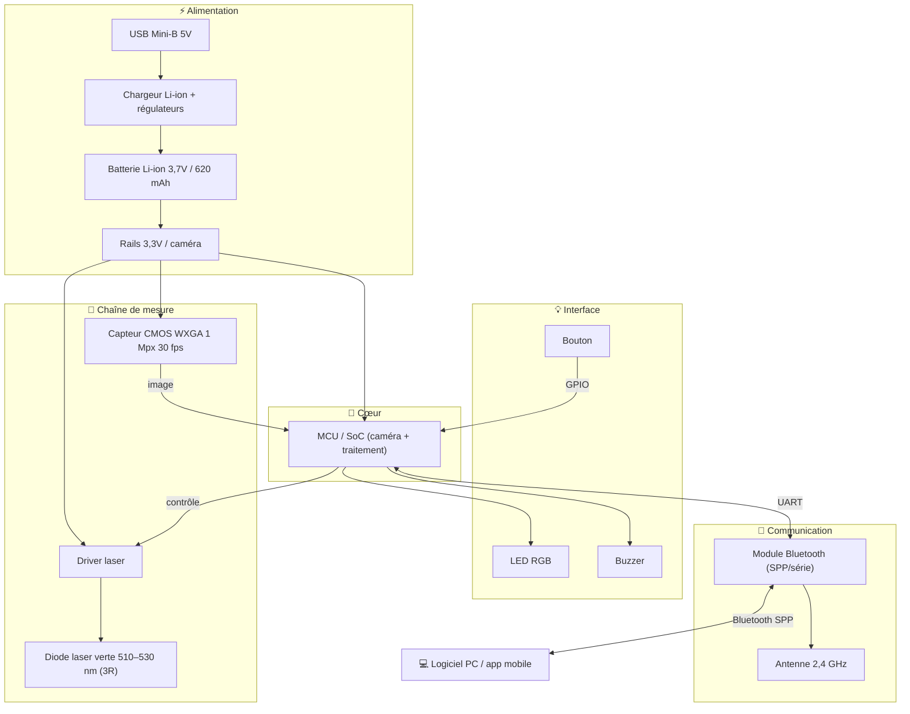

# Concours National Informatique — Ynov × FACOM

## Réemploi RSE du produit FACOM SCANDIAG® (DX.TSCANPB)

### Dossier de proposition à la Direction RSE de FACOM

**Concept retenu — « SCANDIAG·LAB » : seconde vie en plateforme pédagogique de vision & mesure embarquée**

---

*Groupe Stanley Black & Decker — marque FACOM*
*Date : [JJ/MM/AAAA] · Campus : [Ville] Ynov Campus*

---

## Membres de l'équipe

| Nom Prénom | Classe (B3 / M1 / M2) | Campus (Ville Ynov Campus) | Rôle |
|---|---|---|---|
| [À COMPLÉTER] | [B3/M1/M2] | [Ville] Ynov Campus | [ex. rétro-ingénierie] |
| [À COMPLÉTER] | | | |
| [À COMPLÉTER] | | | |
| [À COMPLÉTER] | | | |

---

## Synthèse (executive summary)

Le **FACOM SCANDIAG® (DX.TSCANPB)**, analyseur d'usure de disques de frein et de pneus aujourd'hui arrêté, est un concentré de technologies embarquées : **micro-caméra CMOS**, **laser ligne**, **MCU de traitement d'image**, **liaison Bluetooth série**, **batterie Li-ion** et **IHM** (bouton, LED RGB, buzzer). Plutôt que de le mettre au rebut, nous proposons d'en **réemployer 100 % du stock**, sans démantèlement, en le transformant en **kit pédagogique « SCANDIAG·LAB »** destiné aux promotions Informatique d'Ynov (B3/M1/M2) — et diffusable ensuite à d'autres écoles et fablabs.

Ce choix maximise l'argument RSE (**zéro rebut**, revalorisation de l'objet entier), reste **faisable** (le livrable est surtout de la documentation et un firmware/protocole ouverts) et est **méta-cohérent** : ce concours est lui-même un TP de rétro-ingénierie réussi — nous industrialisons ce qui fonctionne déjà aujourd'hui.

> **En une phrase** : un outil invendu devient un support de cours réel pour former de futurs ingénieurs à la vision, à l'embarqué et à la rétro-ingénierie — une boucle vertueuse FACOM ↔ Ynov.

---

## Correspondance avec le contenu de dossier exigé

| Élément attendu (sujet) | Section de ce dossier | État |
|---|---|---|
| Membres de l'équipe | ci-dessus | [À COMPLÉTER] |
| Datasheets des composants clés | §4 + dossier `/datasheets/` | à collecter le jour J |
| Schéma fonctionnel du produit | §3 | ✅ |
| Descriptifs des idées de réemploi avec notation | §5 | ✅ |
| Concept retenu et justification | §6 | ✅ |
| Archive du/des programme(s) développés (firmware) | §7 + `/poc/` | POC fourni, firmware en option |
| Documentation des fonctions développées | §7 + annexes | ✅ |

> 📎 **Annexes (documents joints) :** `concours_natio_flo.md` (dossier technique détaillé, Phases 1–4 + Annexe A) · `TP2_communication_serie.md` (fiche de TP) · `poc/scandiag_client.py` (outil de communication) · `images_facom/` (photos) · `Notice-FACOM-DX-TSCANPB.pdf`.

---

## 1. Le produit et son contexte

| | |
|---|---|
| **Désignation** | SCANDIAG — Analyseur de disques de frein et de pneus |
| **Référence** | DX.TSCANPB (kit) · outil seul : DX.TSCAN-1 |
| **EAN** | 3662420 415668 |
| **Fabricant** | Stanley Black & Decker (FACOM) — **Made in Italy** |
| **OEM identifié** | **TEXA S.p.A. — *Laser Examiner*** (le SCANDIAG en est la version rebrandée) |
| **État** | Produit arrêté, stock immobilisé → objet du défi RSE |

**Fonction d'origine** : projeter une **ligne laser verte** sur un disque/pneu, capturer sa déformation avec une **micro-caméra CMOS**, et reconstruire le profil d'usure par **triangulation optique** ; résultat transmis en **Bluetooth** à un logiciel PC (précision 0,1 mm, sans démonter la roue).

---

## 2. Caractéristiques techniques

| Paramètre | Valeur |
|---|---|
| Micro-caméra | CMOS **WXGA, 1 Mpx, 30 fps** |
| Laser | Classe **3R**, **> 5 mW**, **510–530 nm** (vert), impulsion 10 ms |
| Communication | **Bluetooth** (profil série SPP), 2400–2483,5 MHz, 0 dBm |
| Batterie | **Li-ion 3,7 V / 620 mAh** (~2,3 Wh, ~500 mesures) |
| Charge | USB **Mini-B** 5 V / 0,5 A — chargeur secteur 100/240 V → 5 V / 1,2 A |
| IHM | Bouton multifonction + **LED RGB** + **buzzer** |
| Temp. / Poids | 0–40 °C / 90 g (outil) |

*Détails, codes LED et contenu de la mallette : voir `concours_natio_flo.md` §1–2.*

---

## 3. Schéma fonctionnel du produit

**Flux mesure :** `bouton → laser ON → 2ᵉ appui → capture caméra → traitement MCU → UART → Bluetooth → PC → bip OK`.

---

## 4. Composants clés & datasheets

> ✅ **Appareil ouvert** : références relevées sur photos (`images_facom/interieur/`). Datasheets à archiver dans `/datasheets/`.

| Composant | Référence **vérifiée** | Détails |
|---|---|---|
| **MCU** | **STMicroelectronics STM32F429** | ARM Cortex-M4 @180 MHz, interface caméra **DCMI**, contrôleur **FMC** (SDRAM) |
| **SDRAM** | **ISSI IS42S16400J-6BLI** | 64 Mbit (8 Mo) — buffer d'image |
| **Caméra** | **OmniVision OV9712** (module `JAL-KM1-OV9712`) | CMOS WXGA 1280×800, 1 Mpx, sortie DVP + I²C, sur nappe FFC |
| **Bluetooth** | **Bluegiga / Silicon Labs WT12-A** | BT 2.1 Classic, firmware **iWRAP** → **SPP sur UART** (115200 8N1) |
| **USB ↔ série** | **FTDI FT232RQ** | pont USB-UART → le port USB porte **des données** (voie de comm/flash filaire) |
| **Batterie** | **EEMB LP602248** | LiPo 3,7 V / 620 mAh / 2,3 Wh |
| **Laser** | module diode **verte** + lentille de ligne | ≤5 mW, 510–530 nm, **classe 3R**, JST 3 pts |
| **Driver / régul.** | **ON Semiconductor** `RM R934` (+ régulateurs) | à confirmer (loupe) |
| **Mémoire ext.** | non identifiée (`9CA15 / RB151`) | probable flash NAND/NOR — à confirmer |
| **IHM** | bouton + LED RGB + buzzer | sur GPIO du STM32 |

*Comparaison hypothèses/réalité, schéma vérifié et implications : `concours_natio_flo.md` Annexe B.*

---

## 5. Idées de réemploi (idéation notée)

**Valeur** = utilité/impact (1–10) · **Difficulté** = effort technique (1–10) · **Réemploi** = part du produit réutilisée (0–100 %).

| # | Concept | Valeur | Difficulté | Réemploi |
|---|---|:---:|:---:|:---:|
| C1 | Scanner 3D / profilomètre de table (makers) | 8 | 6 | 85 % |
| C2 | Capteur prédictif d'usure d'outils & pièces (RSE maintenance) | 9 | 5 | 90 % |
| C3 | Contrôle qualité impression 3D / surface | 8 | 7 | 80 % |
| C4 | Caméra d'inspection Bluetooth (endoscope) | 6 | 3 | 60 % |
| C5 | Capteur de niveau de remplissage de bacs de tri | 7 | 5 | 70 % |
| C6 | Barrière / compteur optique de passage (biodiversité, flux) | 7 | 4 | 65 % |
| **C7** | **Plateforme pédagogique « vision & mesure embarquée » (retenu)** | **9** | **4** | **95 %** |
| C8 | Profilomètre de matériaux recyclés (granulométrie) | 7 | 7 | 80 % |

*Descriptifs complets de chaque concept (problématique RSE, fonctions utilisées, ajouts) : `concours_natio_flo.md` Phase 3.*

---

## 6. Concept retenu & justification — C7 « SCANDIAG·LAB »

**Chaque outil invendu devient un kit de TP ouvert et documenté** pour enseigner l'embarqué, la vision et la rétro-ingénierie aux promotions Informatique d'Ynov.

| Critère de sélection FACOM | Pourquoi C7 est le meilleur choix |
|---|---|
| **Pertinence RSE** | **Réemploi de 100 % du stock**, sans rebut ni démantèlement — l'objet est revalorisé entier. |
| **Faisabilité** | Aucun matériel neuf indispensable : le livrable est de la **documentation + firmware/protocole ouverts** (difficulté 4/10). |
| **Cohérence** | **Méta-cohérent** : ce concours *est* déjà un TP de rétro-ingénierie réussi. La preuve de concept, c'est nous. |
| **Aboutissement du POC** | Réalisable en 7 h : établir la communication + livrer **1 TP fonctionnel** suffit à valider le concept. |
| **Valorisation FACOM** | Kit **co-brandé FACOM × Ynov** : visibilité auprès de futurs ingénieurs, image RSE concrète, vivier de talents. |

**Programme pédagogique** : 6 TP gradués B3→M2 (ouverture/rétro-ingénierie · liaison série/BT · capture & traitement d'image · triangulation/mesure · firmware · projet IoT). *Détail : `concours_natio_flo.md` « Concept retenu ».*

---

## 7. POC & programmes développés

**Objectif POC (Phase 4)** : prouver que l'outil réemployé est **pilotable et exploitable** par les étudiants, et livrer **au moins un TP fonctionnel**.

**Stratégie en 2 paliers :**
1. **Palier 1 — sans reflash (sûr)** : l'outil expose sa liaison Bluetooth comme **port série** → on **rétro-conçoit le protocole** et on écrit un client ouvert.
2. **Palier 2 — firmware ouvert (stretch)** : si un point de flash est accessible, firmware minimal pilotant LED/laser/buzzer/caméra (backup du firmware d'origine au préalable).

> ✅ **Le teardown dé-risque fortement le POC** : (1) l'outil offre **deux voies série** — Bluetooth (WT12 iWRAP, SPP 115200) **et USB filaire** (FTDI FT232RQ, sans appairage) ; (2) tous les composants sont **documentés publiquement** (STM32F429, OV9712, WT12/iWRAP, FT232RQ) ; (3) le **STM32F429 est reflashable** (SWD, ou bootloader série ST via le FT232 + BOOT0), ce qui rend le **Palier 2 réaliste**. Détails : `concours_natio_flo.md` Annexe B.

**Programmes fournis :**
- [`poc/scandiag_client.py`](poc/scandiag_client.py) — client/explorateur série (modes `ports`, `monitor`, `repl`, `replay`) pour capturer et rétro-concevoir le protocole. *Testé : syntaxe OK, CLI fonctionnelle.*
- [`TP2_communication_serie.md`](TP2_communication_serie.md) — fiche de TP complète (objectifs, sécurité, étapes guidées, 7 questions, grille d'évaluation).

**Documentation des fonctions** : chaque mode du client et chaque étape du TP sont documentés dans les fichiers ci-dessus ; la séquence de communication cible et les critères de réussite figurent dans `concours_natio_flo.md` Phase 4.

> Le firmware custom (Palier 2) est **optionnel** et dépend de l'accessibilité du flash, déterminée à l'ouverture. Le POC **ne dépend pas** du reflash — le Palier 1 garantit une démonstration.

---

## 8. Sécurité & RSE (rappels)

- **Laser classe 3R** : danger oculaire — ne jamais fixer/diriger le faisceau ; pointer une surface mate.
- **Batterie Li-ion** : pas de court-circuit ni d'échauffement ; travailler sur USB si batterie faible ; sauvegarder avant tout reflash.
- **RSE** : tout composant sorti du produit reste en zone de travail ; documentation et photos au fil de l'eau ; objectif zéro rebut.

---

*Dossier réalisé dans le cadre du Concours National Informatique Ynov × FACOM.*
*Annexes techniques jointes — voir §Correspondance.*

