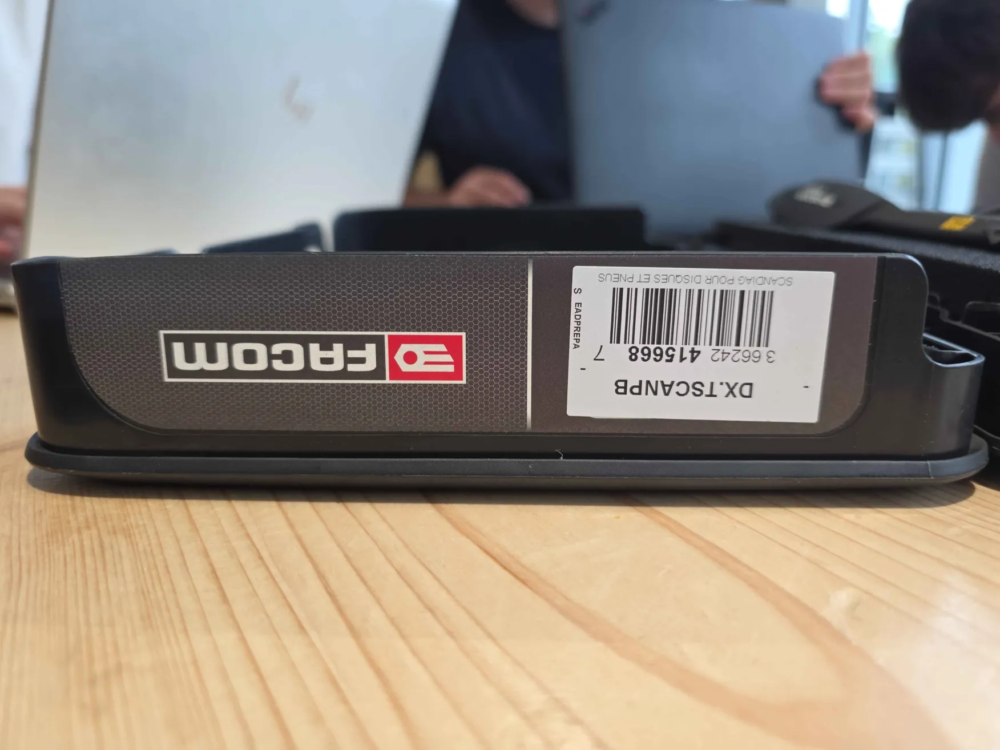
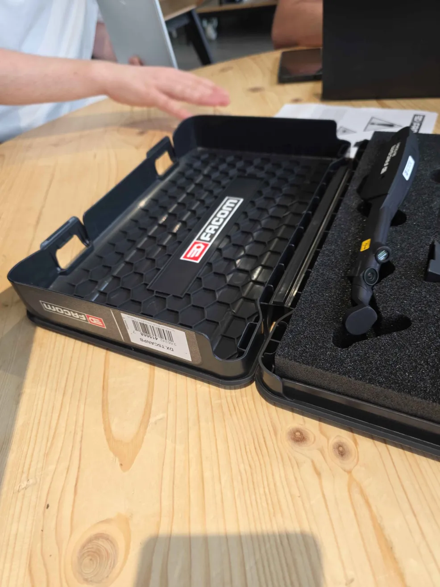
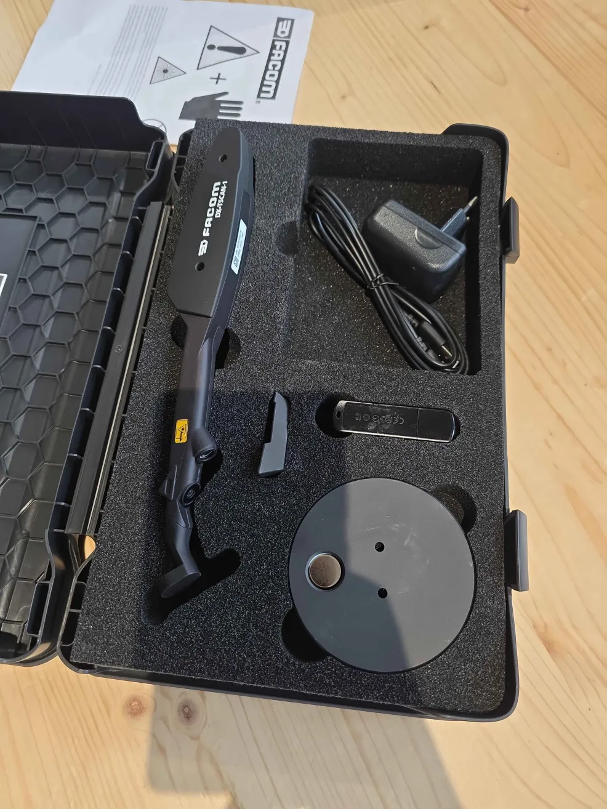
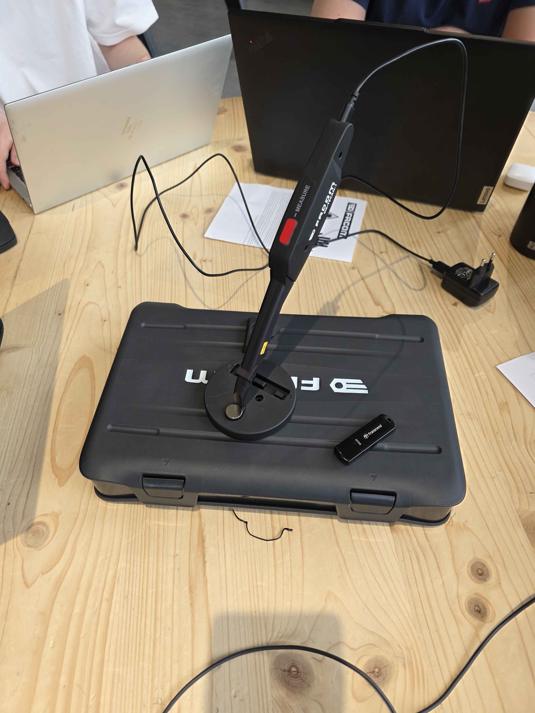
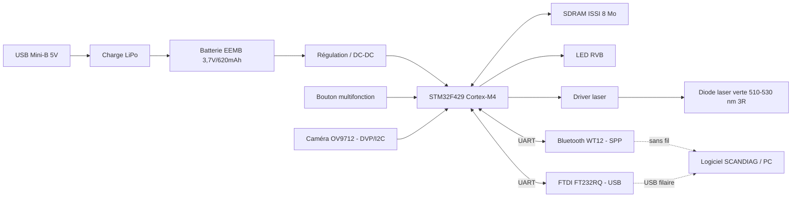
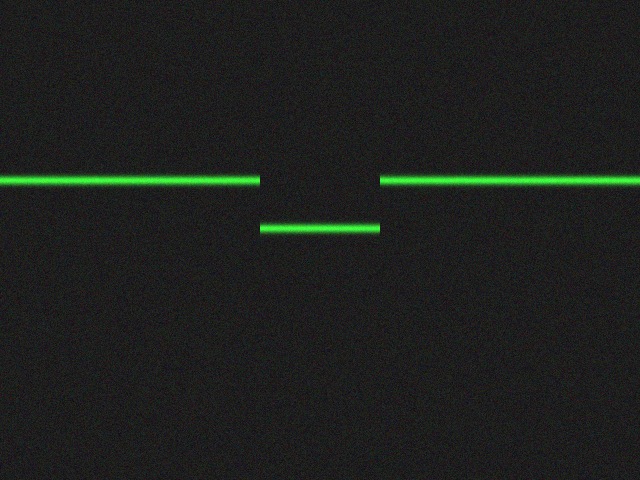

# Concours National Informatique — Dossier de réemploi RSE

## FACOM SCANDIAG® DX.TSCANPB — Projet **ReBike** (verticale du concept **ReScan**)

---

### Présentation de l'équipe

- **Campus :** [Ville] Ynov Campus
- **Classe :** [B3 / M1 / M2]

| Nom / Prénom | Classe | Rôle |
|---|---|---|
| Stoffelbach Théo | M1 Dev Fullstack | Chef de projet / coordination |
| Remery Lucas | M1 Dev Fullstack | Rétro-ingénierie fonctionnelle |
| Detres Florent | M1 Dev Fullstack | Recherche documentaire |
| Breton Swann | M1 Dev Fullstack | Développement POC |
| Abadie Thomas | M1 Dev Fullstack | Documentation / rendu |

---

## Résumé exécutif

Le **FACOM SCANDIAG® DX.TSCANPB** est un instrument de mesure optique portable : il projette une ligne laser sur une surface et la photographie avec une micro-caméra pour en déduire un profil d'usure (disques de frein, bande de roulement). Le principe physique sous-jacent est la **triangulation laser** (lumière structurée) — une brique réutilisable bien au-delà de l'automobile.

Le produit n'étant plus commercialisé, nous proposons de **conserver son architecture complète** (laser, caméra, batterie, Bluetooth, boîtier, mallette) et de **détourner son usage** vers d'autres contrôles d'usure.

- **Vision (ReScan) :** une jauge optique multi-usages (mobilité douce, EPI, caoutchouc industriel, pédagogie).
- **Concept retenu pour ce rendu (ReBike) :** contrôle d'usure des pneus de **vélos, vélos-cargo et trottinettes électriques**, marché en forte croissance et techniquement le plus fidèle à l'outil d'origine.

Taux de réemploi estimé : **~85 %**. Double gain RSE : on évite la mise au rebut du SCANDIAG®, et on prolonge la durée de vie des objets qu'il contrôle.

> **Note de méthode :** nous avons **ouvert le produit** et relevé les références réelles de ses composants (§3.2, Annexe 2). Le POC retenu (« niveau A », par vision) reste **indépendant du firmware** — il reproduit la chaîne de mesure côté logiciel — mais le démontage nous permet (1) d'**identifier l'électronique** comme l'exige le sujet, (2) de **joindre les datasheets** des composants clés, et (3) d'ouvrir une voie de POC matériel (niveau B/C, §8.2). Le dossier distingue ce qui est **vérifié sur la carte** (références sérigraphiées) de ce qui reste à confirmer (deux puces secondaires, points de flash).

---

## 1. Présentation du produit

Le kit se présente dans une mallette rigide FACOM. Référence produit relevée sur l'étiquette : **DX.TSCANPB** (code-barres `3 662420 415668`), libellé *« SCANDIAG POUR DISQUES ET PNEUS »*. L'appareil principal porte le marquage **DX.TSCAN-1**.

| Mallette fermée (étiquette produit) | Mallette ouverte | Kit complet |
|---|---|---|
|  |  |  |

**Contenu observé du kit** (photo de droite) : l'appareil SCANDIAG® dans sa mousse, le chargeur secteur, la clé USB (logiciel + documentation), l'adaptateur magnétique circulaire de vérification, et la notice (pictogrammes de danger laser visibles). L'appareil est portable, ergonomique, robuste, et muni d'un bouton de commande unique (marqué **MEASURE**) et d'une zone optique à son extrémité.

**Mise en situation — chaîne de mesure.** L'appareil (version **DX.TSCAN-1**) monté sur l'adaptateur de vérification magnétique, **relié en USB au PC** : c'est la configuration de calibration / d'acquisition.



---

## 2. Caractéristiques techniques

*Source : notice constructeur (tableau « Caractéristiques techniques »).*

| Élément | Donnée |
|---|---|
| Produit | FACOM SCANDIAG® DX.TSCANPB |
| Fonction d'origine | Analyseur de disques de frein et de pneus |
| Alimentation externe (chargeur) | 100 / 240 V AC |
| Sortie chargeur | 5 V / 1,2 A — USB Mini-B |
| Entrée de l'outil | 5 V / 0,5 A |
| Batterie interne | Li-Ion, 0,620 Ah, 3,7 V |
| Classe laser | 3R |
| Puissance laser | > 5 mW |
| Longueur d'onde | 510 – 530 nm (vert) |
| Micro-caméra | CMOS WXGA, 1 mégapixel, 30 fps |
| Communication | Bluetooth® intégré, 2400 – 2483,5 MHz, 0 dBm |
| Interface utilisateur | Bouton poussoir + LED RVB |
| Température fonctionnement / stockage | 0 – 40 °C / −20 – 60 °C |
| Humidité | 10 – 80 %, sans condensation |
| Poids | 90 g (outil), 10 g (adaptateur) |

> ✅ La ligne OCR ambiguë de la notice (« m/s 10 ») est en fait la **durée d'impulsion du laser : 10 ms**, confirmée par l'**étiquette du boîtier** (« pulse duration = 10 ms », norme IEC 60825-1:2014).

---

## 3. Phase 1 — Rétro-ingénierie

### 3.1 Composants externes identifiés (notice)

| Repère | Élément | Fonction |
|---:|---|---|
| 1 | Bouton multifonction + LED multicolore | Marche/arrêt, déclenchement mesure, retour d'état |
| 2 | Connecteur USB | Recharge de la batterie interne |
| 3 | Diode laser | Projection de la ligne de mesure |
| 4 | Micro-caméra | Capture de l'image projetée |
| 5 | Aimant | Maintien / positionnement |
| 6 | Adaptateur analyse pneus | Positionnement sur pneu |
| 7 | Adaptateur vérification | Calibration / contrôle périodique |
| 8 / 9 | Câble / chargeur USB | Alimentation |
| 14 | Code date | Année de fabrication |

### 3.2 Composants internes (relevés après ouverture)

Nous avons **ouvert l'appareil** et photographié la carte (photos dans `images_facom/interieur/`). Les sérigraphies étant lisibles, la rétro-ingénierie passe du **fonctionnel** au **factuel** : voici les références réellement identifiées.

| Fonction | Référence **vérifiée** | Détails | Photo |
|---|---|---|---|
| **MCU** | STMicroelectronics **STM32F429** | ARM Cortex-M4 @180 MHz, interface caméra **DCMI**, contrôleur mémoire **FMC** | IMG_9638/9639 |
| **SDRAM** | ISSI **IS42S16400J-6BLI** | 64 Mbit (8 Mo) — buffer d'image (traitement embarqué) | IMG_9638/9639 |
| **Caméra** | OmniVision **OV9712** (module `JAL-KM1-OV9712 V4.0`) | CMOS WXGA 1280×800, 1 Mpx, sortie DVP + I²C (SCCB), sur nappe FFC | IMG_9642 |
| **Bluetooth** | Bluegiga / Silicon Labs **WT12-A** (`FCC ID QOQWT12A`) | BT 2.1 Classic, firmware **iWRAP** → profil série **SPP** sur UART (115200 8N1) | IMG_9644/9645 |
| **USB ↔ série** | FTDI **FT232RQ** | pont USB-UART : le port USB Mini-B porte **des données** (pas que la charge) | IMG_9645 |
| **Batterie** | EEMB **LP602248** | LiPo 3,7 V / 620 mAh / 2,3 Wh, connecteur JST 2 pts | IMG_9646 |
| **Laser** | module diode **verte** + lentille de ligne | ≤5 mW, 510–530 nm, classe 3R, connecteur JST 3 pts (alim/masse/enable) | IMG_104207 |
| **Driver / régul.** | ON Semiconductor `RM R934` (+ régulateurs) | près du bloc laser/caméra — fonction à confirmer (loupe) | IMG_9641 |
| **Mémoire ext.** | *non identifiée* (`9CA15 / RB151`) | grand boîtier près de la SDRAM → probable flash NAND/NOR | IMG_9639 |
| **PCB** | réf. `3909305 / PC524-E`, date `19.19` | fabrication semaine 19 / 2019 | IMG_9640 |

**Ce que cela confirme et débloque :**
- La **liaison « Bluetooth » est en fait du série** (SPP via le module WT12) — et il existe **en plus** une voie **USB-série filaire** (FT232RQ), sans appairage. Deux portes d'entrée pour dialoguer avec l'outil.
- Le **STM32F429 est un MCU grand public très documenté** (caméra + SDRAM + USB), **reflashable** via **SWD** ou via le **bootloader série** ST (UART + BOOT0, accessible par le FT232). Le firmware alternatif (niveau C) devient donc **réaliste**, plus seulement théorique.
- Tous les composants principaux ont une **datasheet publique** → livrable « datasheets » couvert (Annexe 2).

### 3.3 Schéma fonctionnel du produit



### 3.4 Chaîne de mesure : la triangulation laser

C'est le point clé pour le réemploi. La diode projette une **ligne** sur la surface ; la caméra, décalée d'un angle connu, observe la **déformation** de cette ligne. La géométrie (triangulation) convertit cette déformation en **profil de profondeur**. C'est exactement la même physique qu'un scanner 3D à lumière structurée — d'où la généralisation possible à tout objet présentant des rainures ou un relief.


---

## 4. Sécurité

**Risques :** faisceau laser classe 3R (lésion oculaire), batterie Li-Ion (court-circuit, échauffement, >130 °C = explosion), choc électrique à la recharge, fragilité caméra/lentilles.

**Règles pendant le TP :**
- Ne jamais regarder le faisceau ni le pointer vers une personne ; pas d'instrument optique pour l'observer.
- N'activer le laser qu'une fois l'outil correctement positionné.
- Ne pas court-circuiter / percer / chauffer la batterie ; charge entre 4 °C et 40 °C uniquement.
- Pas d'usage en milieu humide ni près de liquides/gaz inflammables.
- Toute pièce démontée reste dans la zone de travail (RSE).

---

## 5. Phase 2 — Champ des possibles

### 5.1 Fonctions matérielles réutilisables

| Fonction | Réemploi | Intérêt |
|---|---|---|
| Laser 510–530 nm | Mesure optique, repère, profil | Très élevé |
| Caméra CMOS 1 MP | Capture, analyse visuelle, relief | Très élevé |
| Bluetooth intégré | Transmission PC/app | Élevé |
| Batterie Li-Ion | Autonomie portable | Élevé |
| Bouton + LED RVB | Déclenchement + retour d'état | Élevé |
| Boîtier ergonomique | Outil portable prêt à l'emploi | Très élevé |
| Adaptateurs + aimant | Positionnement / calibration | Élevé |
| Mallette | Kit pro / pédagogique | Très élevé |

### 5.2 Ajouts possibles

| Ajout | Fonction | Connexion |
|---|---|---|
| Application mobile | Affichage / historique | Bluetooth |
| Interface PC dédiée | Rapport de contrôle | Bluetooth / COM |
| Écran OLED | Affichage autonome (sans PC) | I²C / SPI (selon accès carte) |
| Buzzer | Signal conforme / non conforme | GPIO (selon accès carte) |
| Supports imprimés 3D | Adaptation à d'autres objets | Mécanique |
| Algorithme de vision | Mesure automatique du profil | Logiciel |

### 5.3 Limites

| Limite | Conséquence |
|---|---|
| Firmware propriétaire | Reprogrammation incertaine (contournée par l'approche vision) |
| Accès données caméra non garanti | Traitement direct difficile |
| Caméra calibrée pneus/disques | Recalibrage pour nouveaux usages |
| Dépendance logiciel SCANDIAG | Limite l'usage autonome |
| USB surtout dédié à la charge | Communication USB non garantie |
| Laser 3R | Cadre de sécurité strict |

---

## 6. Phase 3 — Idéation

| # | Concept | Description courte | Valeur | Difficulté | Réemploi | RSE |
|---|---|---|---:|---:|---:|---:|
| 1 | **ReScan** | Jauge optique portable multi-usages (vision) | 9/10 | 6/10 | 85 % | 9/10 |
| 2 | **ReBike** | Contrôle d'usure pneus vélo / trottinette | 8/10 | 5/10 | 80 % | 8/10 |
| 3 | SafeStep | Contrôle d'usure semelles EPI | 7/10 | 6/10 | 75 % | 8/10 |
| 4 | Kit pédagogique IoT | Support de TP rétro-ingénierie / vision | 7/10 | 4/10 | 90 % | 7/10 |
| 5 | Inspecteur caoutchouc | Bandes transporteuses / surfaces planes | 8/10 | 7/10 | 75 % | 8/10 |

ReScan est la **vision** (la plus ambitieuse), mais une vision n'est démontrable que par une **première verticale concrète**. La question décisive est donc : **ReScan (large) ou ReBike (focalisé) pour ce rendu et son POC ?**

---

## 7. Concept retenu — analyse ReScan vs ReBike

### 7.1 Matrice de décision

Pondération alignée sur les **critères de sélection FACOM** (idéation, faisabilité, aboutissement du POC, qualité/lisibilité du livrable).

| Critère (pondération) | ReScan (plateforme large) | ReBike (verticale focalisée) |
|---|---|---|
| **Faisabilité du POC en 7 h** (×3) | Faible — exige plusieurs profils de calibration et objets très différents → dispersion | **Forte** — un seul objet type, géométrie proche du pneu auto d'origine |
| **Fidélité à la techno d'origine** (×2) | Moyenne — usages parfois éloignés (semelles, bandes) | **Très forte** — même mesure de bande de roulement, plus petite |
| **Clarté du marché / pertinence RSE** (×2) | Diffuse — « un peu pour tout » | **Nette** — ateliers vélo/trottinette, sécurité mobilité douce |
| **Crédibilité industrielle** (×2) | Risque « couteau suisse » difficile à valider | **Produit identifiable**, argumentaire net |
| **Ambition / potentiel** (×1) | **Très élevée** — plateforme évolutive | Élevée, mais plus étroite |
| **Taux de réemploi** (×1) | 85 % | 80 % |

**Lecture :** ReScan gagne sur l'ambition, ReBike gagne sur **tout ce qui est noté le plus lourdement** : faisabilité, fidélité technique, clarté, crédibilité. Pour un livrable lu par un industriel et un POC à produire en temps contraint, le focus l'emporte.

### 7.2 Décision : **ReBike**, première verticale de la vision ReScan

On ne sacrifie pas l'ambition : **ReBike est le produit, ReScan est la feuille de route.** On démontre une chose, parfaitement, puis on montre comment elle s'étend (SafeStep, caoutchouc industriel, pédagogie). C'est la stratégie « land & expand », la plus convaincante face à un partenaire industriel.

### 7.3 ReBike — description

Réemploi du SCANDIAG® comme **contrôleur d'usure de pneus de mobilité douce** (vélo, vélo-cargo, trottinette, scooter). L'outil mesure la profondeur des rainures de la bande de roulement et classe l'état : **conforme / à surveiller / à remplacer**.

| Domaine | Objet contrôlé | Objectif |
|---|---|---|
| Mobilité douce | Pneu vélo / trottinette | Vérifier la profondeur des rainures |
| Sécurité | Usure critique | Détecter un pneu dangereux (adhérence) |
| Maintenance atelier | Suivi client | Historique et traçabilité des contrôles |

**Pourquoi c'est crédible :** mesurer la profondeur de bande de roulement est **déjà une fonction native** du SCANDIAG® ; on ne change que la taille de l'objet et les seuils. Le risque technique est minimal.

**Ajouts nécessaires :** gabarit/support imprimé 3D pour pneus fins, seuils adaptés (vélo/trottinette), interface de classement simple.

**Intérêt RSE (double) :** éviter la mise au rebut du SCANDIAG® **et** sécuriser/prolonger la vie des pneus de mobilité douce (secteur en plein essor, enjeu sécurité réel).

---

## 8. Phase 4 — Preuve de concept (ReBike)

### 8.1 Objectif

Démontrer qu'à partir d'une image de **ligne laser projetée sur une rainure de pneu**, on peut **mesurer une profondeur** et en **déduire un verdict d'usure** — c'est-à-dire reproduire, en réemploi, la chaîne de mesure du SCANDIAG®.

### 8.2 Trois niveaux de POC (selon l'accès matériel obtenu)

| Niveau | Pré-requis | État | Démonstration |
|---|---|---|---|
| **A — Vision (retenu, implémenté)** | Une image de la ligne laser | ✅ développé et exécuté | Traitement d'image → profil → profondeur → verdict |
| **B — Série / Bluetooth** | Dialoguer avec l'outil | 🟡 voie identifiée | Parler à l'outil via **USB-série (FT232RQ)** ou **SPP (WT12, 115200)** et réutiliser son acquisition |
| **C — Carte / firmware** | Ouverture + points de flash | 🟡 produit ouvert, MCU connu | **STM32F429 reflashable** (SWD ou bootloader série) → firmware alternatif réaliste |

Le **niveau A est celui que nous avons développé et qui s'exécute** : il prouve le principe **sans dépendre du firmware propriétaire**. L'**ouverture du produit** (§3.2) fait passer les niveaux B et C de « théoriques » à « amorcés » : la voie série (FT232RQ/WT12) et le MCU reflashable (STM32F429) sont désormais **identifiés**, ce qui les rend démontrables dans une itération suivante.

### 8.3 Principe du niveau A (triangulation appliquée)

1. Acquérir une image de la ligne laser projetée perpendiculairement à une rainure.
2. Isoler la ligne sur le **canal vert** (laser 510–530 nm) en retranchant rouge et bleu.
3. Pour chaque colonne, estimer la position du laser **au sous-pixel** (centroïde pondéré) → **profil** de la surface.
4. Mesurer la « chute » du profil dans la rainure et la convertir par un **facteur de calibration** (mm/pixel, obtenu via l'adaptateur de vérification) → **profondeur**.
5. Classer selon les seuils et générer un rapport.

Le code complet et exécutable se trouve dans [`rebike-poc/`](rebike-poc/) (`main.py`, ~150 lignes, dépendances : `numpy`, `pillow`). Extrait des fonctions clés :

```python
def extraire_profil_laser(img):
    """Position sous-pixel de la ligne laser par colonne (centroïde pondéré)."""
    img = img.astype(float)
    score = img[:, :, 1] - 0.5 * (img[:, :, 0] + img[:, :, 2])   # isole le vert
    score = score.clip(0)
    seuil = score.max() * 0.5
    lignes = np.arange(score.shape[0])[:, None]
    profil = np.full(score.shape[1], np.nan)
    for x in range(score.shape[1]):
        col = score[:, x]; m = col > seuil
        if m.any():
            profil[x] = (lignes[m, 0] * col[m]).sum() / col[m].sum()
    return profil

def mesurer_profondeur_mm(profil_px, mm_par_px):
    v = profil_px[~np.isnan(profil_px)]
    if v.size < 10:
        return None
    return max(np.percentile(v, 98) - np.median(v), 0.0) * mm_par_px  # fond - surface
```

### 8.4 Résultat d'exécution

En l'absence de photo réelle, le POC génère des **images de test** (ligne laser + rainure de profondeur connue) pour valider la chaîne de bout en bout. Exemple d'image générée (cas « à surveiller ») :



Sortie réelle de `python main.py` :

```text
[pneu de velo - rainure profonde]
  profondeur  : 3.50 mm   ->  CONFORME (Vert)
[pneu de velo - rainure moyenne]
  profondeur  : 2.40 mm   ->  A SURVEILLER (Orange)
[pneu de trottinette - rainure faible]
  profondeur  : 1.20 mm   ->  A REMPLACER (Rouge)
```

La chaîne complète **fonctionne et discrimine correctement** les trois états. Avec une vraie photo de ligne laser : `python main.py photo.jpg --calibration 0.05`.

### 8.5 Seuils de classement (mobilité douce, démonstration)

| Profondeur mesurée | État | Couleur |
|---:|---|---|
| ≥ 3 mm | Conforme | 🟢 Vert |
| 1,5 – 3 mm | À surveiller | 🟠 Orange |
| < 1,5 mm | À remplacer | 🔴 Rouge |

> Seuils à affiner avec des profils réels ; le facteur de calibration (mm/pixel) s'obtient via l'adaptateur de vérification (géométrie connue), qui est sa fonction d'origine.

---

## 9. Documentation des fonctions développées

| Fonction | Entrée | Sortie | Rôle |
|---|---|---|---|
| `profil_depuis_image()` | Image (BGR) | Profil (px) | Extrait la ligne laser par colonne |
| `profondeur_mm()` | Profil + calibration | Profondeur (mm) | Convertit le profil en profondeur réelle |
| `verdict()` | Profondeur (mm) | État + couleur + reco | Classe l'usure et formule une recommandation |

**Exemple de rapport généré :**

```text
Rapport FACOM ReBike
Objet contrôlé : pneu de vélo (rainure centrale)
Profondeur mesurée : 2,4 mm
État : À surveiller
Indicateur : Orange
Recommandation : effectuer un nouveau contrôle prochainement.
Opérateur : [Nom]    Date : [Date]
```

**Logique couleur** (reprise du SCANDIAG® d'origine) : 🟢 conforme · 🟠 proche de la limite · 🔴 non conforme · ⚫ en attente de mesure.

---

## 10. Apport RSE

**Réemploi du produit (~85 %)** : appareil, batterie, laser, caméra, Bluetooth, bouton, LED, adaptateurs, chargeur, câble, mallette sont tous conservés.

**Gain double :**
1. On évite la destruction d'un produit complet et de ses composants (dont une batterie Li-Ion).
2. On prolonge la vie d'autres objets (pneus de mobilité douce) en évitant leur remplacement prématuré **et** en retirant de la circulation les pneus dangereux.

C'est une réponse directe à l'objectif RSE de FACOM : éviter le gaspillage industriel **tout en créant une nouvelle valeur d'usage**.

---

## 11. Conclusion

Le SCANDIAG® DX.TSCANPB embarque déjà tout ce qu'il faut pour une jauge optique portable : laser, caméra, Bluetooth, batterie, IHM et mallette. Plutôt que de le démanteler pour quelques pièces, nous conservons son architecture et **détournons sa fonction de mesure par triangulation**.

**ReBike** — contrôle d'usure des pneus de mobilité douce — est le concept retenu : techniquement fidèle, démontrable en temps contraint, à marché clair et à fort sens RSE. Il constitue la **première verticale** d'une vision plus large, **ReScan**, dont l'extension (EPI, caoutchouc industriel, pédagogie) est déjà cartographiée. Une solution de réemploi crédible, faisable et industrialisable.

---

## 12. Annexes

### Annexe 1 — Archive du POC (fournie)

Le POC est livré et fonctionnel dans le dossier [`rebike-poc/`](rebike-poc/) :

```text
rebike-poc/
├── main.py              # pipeline complet (extraction → profondeur → verdict) + mode démo
├── README.md            # objectif, usage, seuils, limites
├── rapport_exemple.txt  # rapports générés par le mode démo
└── images/              # images de test générées (ligne laser + rainure)
    ├── synth_conforme.png
    ├── synth_surveiller.png
    └── synth_remplacer.png
```

Lancement : `pip install numpy pillow` puis `python main.py` (mode démo) ou
`python main.py photo.jpg --calibration 0.05` (vraie photo). Voir §8.4 pour la sortie.

### Annexe 2 — Datasheets des composants clés

Après ouverture (§3.2), les références ont été relevées et les datasheets officielles
collectées dans le dossier [`datasheets/`](datasheets/) :

| Composant | Référence | Fichier |
|---|---|---|
| MCU | STMicroelectronics STM32F429 | `MCU_STM32F429.pdf` |
| SDRAM | ISSI IS42S16400J-6BLI | `SDRAM_ISSI_IS42S16400J.pdf` |
| Caméra | OmniVision OV9712 (`JAL-KM1-OV9712`) | `CAM_OmniVision_OV9712.pdf` |
| Bluetooth | Silicon Labs / Bluegiga WT12-A | `BT_Bluegiga_WT12.pdf` + `BT_iWRAP_User_Guide.pdf` |
| USB↔série | FTDI FT232RQ | `USB_FTDI_FT232RQ.pdf` |
| Batterie | EEMB LP602248 (LiPo 3,7 V / 620 mAh) | `BAT_EEMB_LP602248.pdf` |
| Laser | module vert 510–530 nm classe 3R | fiche IEC 60825-1 |

*À confirmer à la loupe puis à ajouter :* la mémoire externe `9CA15 / RB151` (probable
flash NAND/NOR) et le composant ON Semiconductor `RM R934`. L'analyse matérielle détaillée
(comparaison hypothèses/réalité, schéma vérifié, implications POC) figure dans
[`concours_natio_flo.md`](concours_natio_flo.md) (Annexe B).
