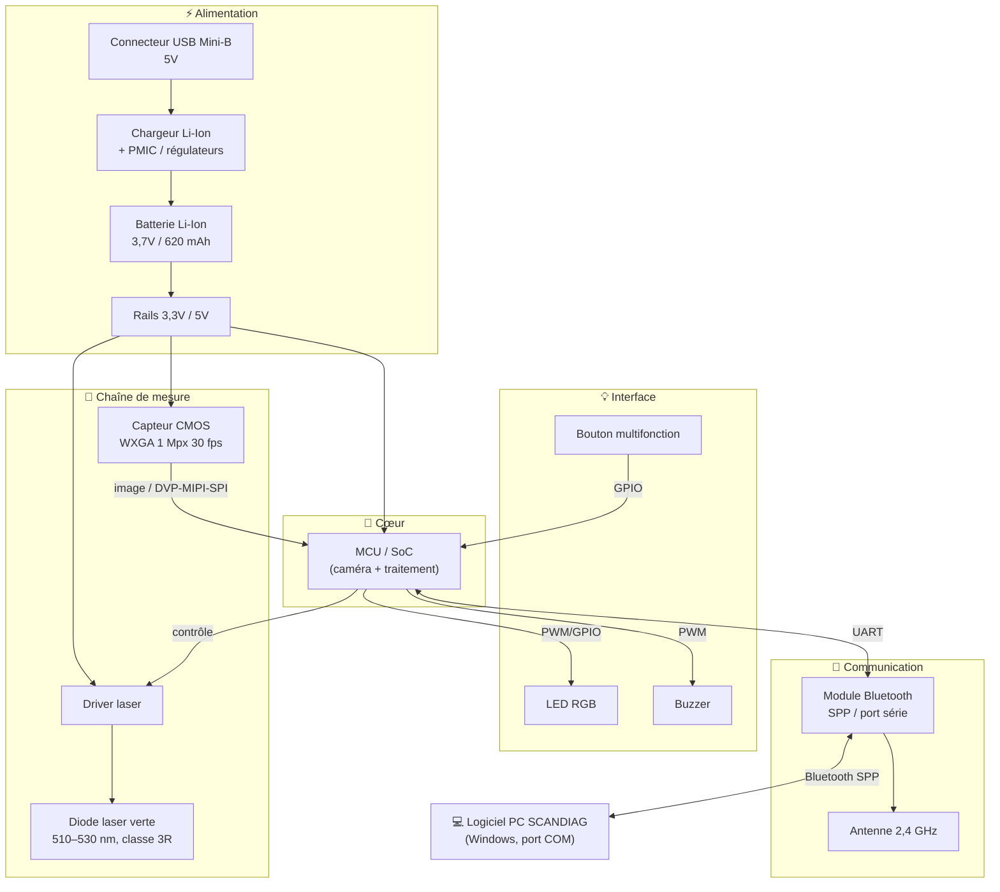
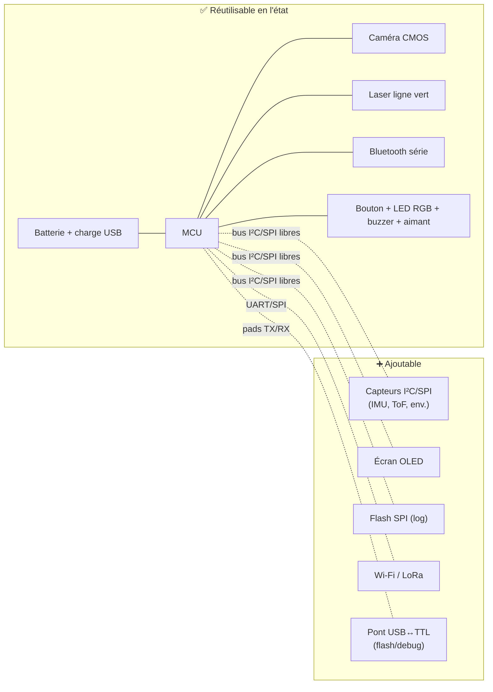
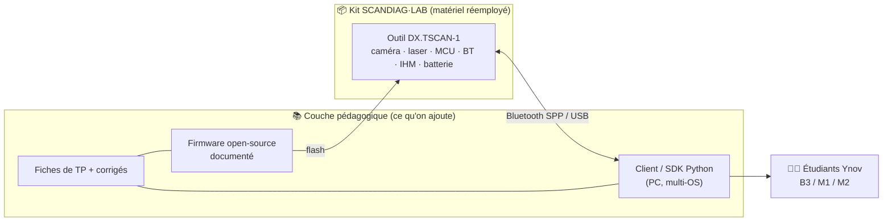
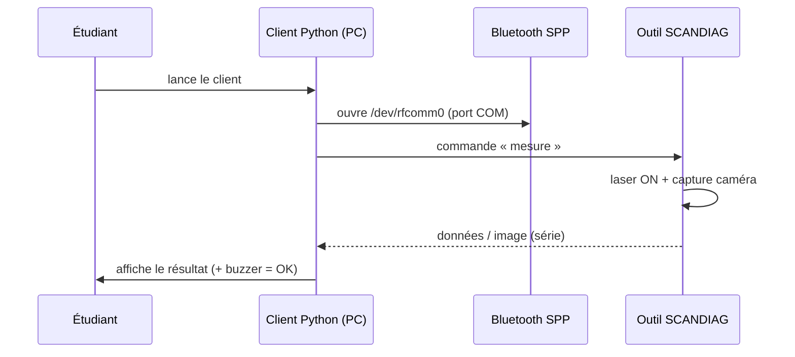

# Concours National Informatique — FACOM / SCANDIAG®

**Réemploi RSE du produit FACOM SCANDIAG® (réf. DX.TSCANPB)**

> Document de travail — Phase 1 : Rétro-ingénierie & synthèse fonctionnelle.
> Sources : notice originale `Notice-FACOM-DX-TSCANPB.pdf`, photos de la mallette (`images_facom/`), recherche en ligne.

---

## 1. Identification du produit

| | |
|---|---|
| **Désignation** | SCANDIAG — Analyseur de disques de frein et de pneus |
| **Référence** | DX.TSCANPB (kit) — outil seul : DX.TSCAN-1 |
| **Code-barres / EAN** | 3662420 415668 |
| **Fabricant** | Stanley Black & Decker (marque FACOM) — Made in Italy |
| **État commercial** | Produit arrêté, stock immobilisé (objet du défi RSE) |

### Fonction d'origine
Outil de garage **portable** qui mesure l'**usure d'un disque de frein** et la **profondeur de bande de roulement d'un pneu**. Principe : une **ligne laser verte** est projetée sur la surface, une **micro-caméra CMOS** capture la déformation de cette ligne, et par **triangulation optique** le profil d'usure est reconstruit. Les données sont envoyées en **Bluetooth** vers un logiciel PC (Windows) qui affiche un résultat graphique coloré (vert/jaune/rouge).

### Contenu de la mallette
| Réf. | Élément |
|---|---|
| DX.TSCAN-1 | Analyseur (outil principal, forme « pistolet ») |
| DX.TSCAN-2 | Adaptateur de vérification du système de mesure (calibration) |
| DX.TSCAN-3 | Adaptateur pour l'analyse de l'usure des pneus |
| DX.TSCAN-4 | Câble USB + chargeur secteur AC |
| DX.TSCANUSB | Clé USB contenant le logiciel PC SCANDIAG |

---

## 2. Caractéristiques techniques (relevées sur la notice)

| Paramètre | Valeur |
|---|---|
| **Micro-caméra** | CMOS **WXGA, 1 Mpx, 30 fps** |
| **Laser** | Classe **3R**, **> 5 mW**, longueur d'onde **510–530 nm** (vert), durée d'impulsion 10 ms |
| **Communication sans-fil** | Module **Bluetooth** intégré, bande **2400–2483,5 MHz**, puissance émise 0 dBm |
| **Batterie interne** | **Li-Ion**, **3,7 V**, **620 mAh** (0,620 Ah) |
| **Entrée de charge** | USB **Mini-B**, **5 V / 0,5 A** |
| **Chargeur secteur** | 100/240 V AC → 5 V / 1,2 A |
| **Interface utilisateur** | **Bouton-poussoir multifonction + LED RGB** |
| **Buzzer** | Avertisseur sonore (confirmation d'acquisition) — *déduit du mode opératoire* |
| **Durée de charge** | 1,5 h (éteint) / 4 h (allumé) |
| **Extinction auto** | Après 5 min d'inactivité sans alim USB |
| **Temp. fonctionnement** | 0 – 40 °C |
| **Poids** | 90 g (outil), 10 g (adaptateur) |

---

## 3. Composants clés à identifier (à l'ouverture)

> ⚠️ Pour chaque composant : relever la **référence sérigraphiée**, télécharger la **datasheet officielle**, l'archiver dans le dossier de rendu, et décrire ses **fonctionnalités exploitables**.

| # | Composant | Rôle | Réf. notice | À relever à l'ouverture |
|---|---|---|---|---|
| 1 | **MCU / SoC** | Cerveau : pilote caméra, laser, BT, LED, buzzer, charge | *non documenté* | Sérigraphie de la puce principale (probable ARM Cortex-M ou SoC avec ISP caméra) |
| 2 | **Module Bluetooth** | Liaison sans-fil (profil **SPP / port série**) | « module Bluetooth intégré » | Réf. module + antenne |
| 3 | **Capteur caméra CMOS** | Capture la ligne laser (mesure) | CMOS WXGA 1 Mpx 30 fps | Réf. capteur + objectif/lentille |
| 4 | **Diode laser + driver** | Émet la ligne laser verte | Classe 3R, 510–530 nm | Réf. diode, circuit driver, optique de ligne |
| 5 | **Batterie Li-Ion** | Alimentation | 3,7 V / 620 mAh | Format (pouch/cylindrique), réf. |
| 6 | **Circuit de charge / PMIC** | Charge Li-Ion + régulation | entrée USB 5 V | Réf. chargeur (ex. TP4056-like), LDO/DC-DC |
| 7 | **Connecteur USB Mini-B** | Charge + data (flash firmware probable) | DX.TSCAN-4 | Lignes D+/D- routées ? (data ou charge seule) |
| 8 | **Bouton multifonction** | Entrée utilisateur | repère ① | — |
| 9 | **LED RGB** | Retour d'état visuel | intégrée au bouton | — |
| 10 | **Buzzer** | Retour sonore | — | Réf. |
| 11 | **Aimant** | Fixation mécanique sur disque/adaptateur | repère ⑤ | — |

### Composants à chercher en plus
Mémoire flash externe (SPI), convertisseur USB↔UART (si flash via USB), IMU/accéléromètre éventuel, régulateurs (LDO / DC-DC), test points (TX/RX/SWD/JTAG).

---

## 4. Schéma de principe fonctionnel

**Lecture du flux mesure :** `Bouton → MCU active le laser → 2ᵉ appui → caméra capture la ligne → MCU traite/compresse → envoi UART → Bluetooth SPP → PC → bip de confirmation`.

---

## 5. Point de flash / bootloader (à documenter)

- La notice prévoit une **mise à jour du microprogramme** depuis le logiciel PC ⇒ il existe un **canal de programmation accessible** (probablement via Bluetooth/série, ou via USB Mini-B).
- À investiguer à l'ouverture :
  - **Test points** marqués TX / RX / GND / VCC / BOOT / RST / SWDIO / SWCLK.
  - Présence d'un **header de debug** (SWD/JTAG) ou de pads.
  - Le connecteur **USB Mini-B** route-t-il les lignes data (D+/D-) ? Si oui → flash possible en USB (DFU / bootloader série).
  - Identifier le **bootloader** du MCU (ROM bootloader série du fabricant ?).
- Documenter : *où se connecter*, *avec quel adaptateur* (USB↔TTL si UART), *quel niveau logique* (3,3 V probable).

---

## 6. Caractéristiques clés à retenir pour la suite

- **Niveaux logiques** : très probablement **3,3 V** (alim issue d'une Li-Ion 3,7 V régulée).
- **Bus présents** : UART (vers BT), interface caméra (DVP/parallèle, MIPI ou SPI selon capteur), I²C/SPI probables (config caméra, flash).
- **Énergie** : 620 mAh @ 3,7 V ≈ **2,3 Wh** — autonomie réelle limitée, recharge USB 5 V.
- **Sécurité** : laser **classe 3R** (dangereux pour les yeux) + batterie Li-Ion (court-circuit/échauffement) → **précautions obligatoires**.
- **Atout réemploi majeur** : le couple **caméra + laser ligne + MCU + Bluetooth série** est une **plateforme de vision/mesure embarquée autonome et communicante** — base idéale pour de nombreux réemplois (voir Phase 3).

---

## 7. À faire (checklist Phase 1)

- [ ] Ouvrir le produit (photos en continu)
- [ ] Relever les références sérigraphiées de chaque puce
- [ ] Télécharger + archiver les datasheets (`/datasheets/`)
- [ ] Identifier MCU, module BT, capteur CMOS, driver laser
- [ ] Repérer les test points / port de flash
- [ ] Mesurer les tensions des rails (multimètre)
- [ ] Confirmer la présence du buzzer et son pilotage
- [ ] Finaliser le schéma fonctionnel avec les vraies références

---

# Phase 2 — Champ des possibles

> Objectif : cartographier **ce qui est réutilisable en l'état**, **ce qui peut être ajouté**, et **les limites**. C'est la base sur laquelle l'idéation tient debout.

## 2.1 Fonctions matérielles réutilisables (en l'état)

| Fonction | Réutilisable pour |
|---|---|
| **Caméra CMOS WXGA 1 Mpx 30 fps** | vision embarquée, capture d'image, lecture de codes, inspection |
| **Laser ligne vert 510–530 nm (classe 3R)** | triangulation, profilométrie, télémétrie, barrière optique, pointeur |
| **Triangulation laser + caméra** | mesure 3D / profil / distance / épaisseur sans contact |
| **MCU / SoC de traitement d'image** | calcul embarqué, pré-traitement |
| **Bluetooth SPP (port série)** | liaison sans-fil universelle vers PC/smartphone/Raspberry |
| **Batterie Li-Ion 3,7 V / 620 mAh + charge USB** | alimentation autonome rechargeable |
| **Bouton + LED RGB + buzzer** | IHM complète (entrée + retour visuel + retour sonore) |
| **Aimant de fixation** | montage rapide sur surface métallique |
| **Format poignée « pistolet » ergonomique** | outil portable tenu en main |

## 2.2 Fonctions ajoutables (points d'extension)

| Ajout possible | Où / comment se connecter |
|---|---|
| Capteurs I²C/SPI (IMU, ToF, température, distance) | bus I²C/SPI du MCU (test points) |
| Écran OLED/LCD (I²C/SPI) | bus libre + alim 3,3 V |
| Modules via UART | en remplaçant ou en partageant le lien BT |
| Mémoire flash externe (log de données) | bus SPI |
| Connecteur d'extension (GPIO libres) | pads/test points non utilisés du MCU |
| Module radio alternatif (Wi-Fi/LoRa) | UART/SPI (pour de l'IoT longue portée) |
| Pont série USB↔TTL | sur les pads TX/RX (pour flash + debug) |

## 2.3 Limites fonctionnelles (à assumer honnêtement)

- **Caméra figée** : optique + focale fixées pour la distance disque/pneu → champ et mise au point contraints.
- **Laser ligne, pas point** : optimisé pour profil, moins pour un simple télémètre ponctuel.
- **Firmware propriétaire fermé** : protocole BT/série non documenté → **rétro-ingénierie du protocole nécessaire**, ou **reflash complet** du MCU.
- **Énergie limitée** : ~2,3 Wh → usages basse consommation ou sessions courtes.
- **Pas de connectivité Internet native** : Bluetooth seul (ajout passerelle nécessaire pour l'IoT).
- **Laser classe 3R** : contraintes de sécurité oculaire pour tout usage grand public.

## 2.4 Schéma fonctionnel « possibilités + extensions »

---

# Phase 3 — Idéation

> Concepts de réemploi explorés largement avant de converger. Notation indicative
> (à affiner après l'ouverture physique). **Valeur** = utilité/impact perçu (1–10) ·
> **Difficulté** = effort technique (1–10) · **Réemploi** = part du produit réutilisée (0–100 %).

### Tableau de synthèse

| # | Concept | Valeur | Difficulté | Réemploi |
|---|---|:---:|:---:|:---:|
| C1 | Scanner 3D / profilomètre de table pour makers | 8 | 6 | 85 % |
| C2 | Capteur prédictif d'usure d'outils & pièces (RSE maintenance) | 9 | 5 | 90 % |
| C3 | Contrôle qualité impression 3D / surface | 8 | 7 | 80 % |
| C4 | Caméra d'inspection Bluetooth (endoscope) | 6 | 3 | 60 % |
| C5 | Capteur de niveau de remplissage de bacs de tri | 7 | 5 | 70 % |
| C6 | Barrière / compteur optique de passage (biodiversité, flux) | 7 | 4 | 65 % |
| C7 | Plateforme pédagogique « vision & mesure embarquée » | 9 | 4 | 95 % |
| C8 | Profilomètre de matériaux recyclés (granulométrie) | 7 | 7 | 80 % |

---

### C1 — Scanner 3D / profilomètre de table pour makers
- **Description** : monter l'outil sur un support fixe au-dessus d'un plateau tournant ; l'objet tourne, le laser-ligne + caméra reconstruisent son profil 3D par triangulation. Sortie nuage de points via le lien série.
- **Enjeux RSE / métiers** : démocratise la numérisation d'objets (réparation, pièces de rechange imprimables) → prolonge la vie des objets, réduit le rebut. Marché maker/fablab/éducation.
- **Fonctions utilisées / ajouts** : caméra + laser + triangulation + BT série (réutilisés). **Ajouts** : plateau tournant motorisé (moteur pas-à-pas + driver) piloté en parallèle, logiciel PC de reconstruction.
- **Valeur 8 · Difficulté 6 · Réemploi 85 %**

### C2 — Capteur prédictif d'usure d'outils & pièces ⭐ (forte cohérence RSE)
- **Description** : garder la **fonction native de mesure d'usure** mais l'élargir à **d'autres pièces** que disques/pneus : outils coupants, plaquettes, engrenages, rails, galets, électrodes… Mesure périodique → suivi de l'usure → maintenance prédictive.
- **Enjeux RSE / métiers** : la maintenance prédictive **évite de jeter trop tôt** (ou trop tard) → moins de gaspillage de pièces et d'énergie. Cœur de métier FACOM (atelier/industrie), donc **réemploi quasi direct du firmware existant**.
- **Fonctions utilisées / ajouts** : **toute la chaîne de mesure d'origine** (réutilisée). **Ajouts** : profils de référence d'autres pièces côté logiciel, base de données de suivi, éventuel QR pour identifier la pièce mesurée.
- **Valeur 9 · Difficulté 5 · Réemploi 90 %**

### C3 — Contrôle qualité d'impression 3D / d'état de surface
- **Description** : scanner laser-ligne fixé sur une imprimante 3D ou un poste de contrôle pour détecter défauts de couche, gauchissement, fissures, rugosité.
- **Enjeux RSE / métiers** : détecter un raté tôt = **moins de filament/matière gâchée**. Utile en fablab et petite production.
- **Fonctions utilisées / ajouts** : caméra + laser + triangulation + MCU (réutilisés). **Ajouts** : algorithme de détection de défauts, intégration mécanique sur l'axe de l'imprimante.
- **Valeur 8 · Difficulté 7 · Réemploi 80 %**

### C4 — Caméra d'inspection Bluetooth (endoscope sans-fil)
- **Description** : réutiliser **uniquement la caméra + BT + batterie** comme caméra d'inspection portable (zones difficiles d'accès, mécanique, plomberie). Laser éteint ou en pointeur.
- **Enjeux RSE / métiers** : diagnostic sans démontage → **réparer plutôt que remplacer**. Simple, accessible.
- **Fonctions utilisées / ajouts** : caméra + BT + batterie + bouton/LED (réutilisés). **Ajouts** : app de visualisation (PC/mobile), éventuel LED d'éclairage.
- **Valeur 6 · Difficulté 3 · Réemploi 60 %** *(le POC le plus rapide)*

### C5 — Capteur de niveau de remplissage de bacs de tri
- **Description** : fixé au couvercle d'un bac, le laser+caméra mesure la distance au sommet des déchets → estime le **taux de remplissage**, transmis en BT/IoT.
- **Enjeux RSE / métiers** : optimise les **tournées de collecte** (moins de trajets à vide → CO₂), améliore le tri. Smart city / gestion des déchets.
- **Fonctions utilisées / ajouts** : laser + caméra + MCU + batterie (réutilisés). **Ajouts** : passerelle IoT (Wi-Fi/LoRa via UART), mode sommeil basse conso, fixation.
- **Valeur 7 · Difficulté 5 · Réemploi 70 %**

### C6 — Barrière / compteur optique de passage
- **Description** : laser + caméra en « tripwire » intelligent : compte les passages (personnes, véhicules, animaux), voire classifie par vision.
- **Enjeux RSE / métiers** : suivi de **biodiversité** (faune), comptage de flux (mobilité douce, fréquentation), sans capteur dédié neuf.
- **Fonctions utilisées / ajouts** : caméra + laser + MCU + BT (réutilisés). **Ajouts** : logique de comptage/horodatage, stockage (flash), connectivité.
- **Valeur 7 · Difficulté 4 · Réemploi 65 %**

### C7 — Plateforme pédagogique « vision & mesure embarquée » ⭐ (réemploi maximal)
- **Description** : transformer chaque outil en **kit de TP** Ynov : caméra + laser + MCU + BT ouverts et documentés pour enseigner triangulation, traitement d'image, embarqué, protocole série, rétro-ingénierie.
- **Enjeux RSE / métiers** : **réemploi à 100 % du stock** comme matériel pédagogique → revalorise tout le lot sans rebut, et forme des étudiants sur du matériel réel. Boucle vertueuse FACOM ↔ Ynov.
- **Fonctions utilisées / ajouts** : **tout** (réutilisé). **Ajouts** : firmware open-source documenté, fiches de TP, éventuel connecteur d'extension.
- **Valeur 9 · Difficulté 4 · Réemploi 95 %**

### C8 — Profilomètre de matériaux recyclés (granulométrie)
- **Description** : mesurer le profil/taille de granulats issus du recyclage (plastique broyé, copeaux) sur convoyeur, par scan laser-ligne.
- **Enjeux RSE / métiers** : contrôle qualité de la **matière recyclée** → meilleure réincorporation, moins de déchets de production.
- **Fonctions utilisées / ajouts** : caméra + laser + triangulation (réutilisés). **Ajouts** : calibration granulométrie, intégration sur ligne, traitement statistique.
- **Valeur 7 · Difficulté 7 · Réemploi 80 %**

---

## Vers la Phase 4 (POC)

Deux candidats se détachent selon l'objectif :

- **Meilleur compromis valeur/effort/RSE → C2** (maintenance prédictive) : réutilise quasi tout le firmware, cohérent avec le métier FACOM, démontrable rapidement.
- **POC le plus rapide à montrer fonctionnel → C4** (caméra d'inspection BT) : un flux vidéo/BT marche avec un minimum de rétro-ingénierie.
- **Réemploi maximal du stock → C7** (plateforme pédagogique) : argument RSE le plus fort (0 rebut).

> **Décision à prendre en équipe.** Une fois le concept retenu, la Phase 4 consiste à
> faire une **preuve de concept fonctionnelle** : a minima établir la communication
> série/BT avec l'outil et démontrer la fonction clé du concept choisi.

---

# Concept retenu — C7 : Plateforme pédagogique « Vision & Mesure embarquée »

**Nom de travail : SCANDIAG·LAB** — chaque outil invendu devient un **kit de TP** ouvert et documenté pour l'enseignement de l'embarqué, de la vision et de la rétro-ingénierie.

## Justification du choix

| Critère du concours | Pourquoi C7 gagne |
|---|---|
| **Pertinence RSE** | **Réemploi de 100 % du stock**, sans rebut ni démantèlement. C'est la définition même d'une seconde vie : l'objet est revalorisé **entier**, pas pièce par pièce. |
| **Faisabilité** | Aucun matériel neuf indispensable. Le « produit » livré, c'est surtout de la **documentation + un firmware/protocole ouvert**. Difficulté technique faible (4/10). |
| **Cohérence** | **Méta-cohérent avec le concours** : ce défi *est déjà* un TP de rétro-ingénierie réussi. On industrialise ce qui a fait ses preuves aujourd'hui. La preuve de concept, c'est nous. |
| **Aboutissement du POC** | Réalisable en 7 h : établir la communication avec l'outil + produire **un TP fonctionnel** suffit à prouver le concept. |
| **Valorisation FACOM** | Kit **co-brandé FACOM × Ynov** → visibilité auprès de futurs ingénieurs, image RSE concrète pour Stanley Black & Decker, vivier de talents formés sur du matériel réel. |

## Vision produit

L'outil n'est plus un analyseur de freins : c'est une **plateforme d'apprentissage matériel** réunissant, dans un boîtier robuste et alimenté, tout ce qu'on enseigne difficilement sur breadboard :

- un **capteur caméra CMOS** réel,
- un **laser ligne** pour la triangulation,
- un **MCU** à reprogrammer,
- une **liaison Bluetooth série**,
- une **IHM** (bouton, LED RGB, buzzer) et une **batterie**.

Le stock immobilisé alimente directement les promotions **B3 / M1 / M2 Informatique** de tous les campus Ynov — et le kit peut ensuite être diffusé à d'autres écoles/fablabs.

## Programme pédagogique (modules / TP)

| TP | Thème | Compétence visée | Niveau |
|---|---|---|---|
| **TP1** | Ouverture & rétro-ingénierie matérielle | lecture de carte, identification de composants, datasheets | B3 |
| **TP2** | Liaison série / Bluetooth SPP | protocole série, sniffing, client Python | B3/M1 |
| **TP3** | Capture & traitement d'image | acquisition caméra, OpenCV, détection de la ligne laser | M1 |
| **TP4** | Triangulation & mesure | géométrie, calibration, reconstruction de profil/distance | M1/M2 |
| **TP5** | Firmware embarqué | reflash, pilotage GPIO/PWM (LED, laser, buzzer), bas niveau | M2 |
| **TP6** | Projet IoT / extension | ajout capteur ou passerelle, mini-projet libre | M2 |

## Architecture du kit

---

# Phase 4 — Plan de POC

> **Objectif POC** : prouver que l'outil réemployé est **pilotable et exploitable** par les étudiants, et livrer **au moins un TP fonctionnel** de bout en bout. C'est la brique qui valide tout le concept C7.

## Stratégie : 2 paliers (du sûr vers l'ambitieux)

### 🎯 Palier 1 — Client de communication (objectif minimal, **sans reflash**)
Le firmware d'origine reste en place. On **rétro-conçoit le protocole** existant et on écrit un client ouvert qui parle à l'outil.

1. **Repérer le port série** : appairer l'outil en Bluetooth → il apparaît comme **port COM (SPP)**. Sous Linux : `/dev/rfcomm0`.
2. **Capturer le trafic** : lancer le logiciel SCANDIAG officiel (Windows + clé USB fournie) et **sniffer** les échanges (moniteur de port série / `socat` en interposition) pendant une mesure réelle.
3. **Décoder les trames** : identifier les commandes (allumer laser, déclencher capture, récupérer données/image) et le format de réponse.
4. **Réécrire un client Python** (multi-OS) qui : se connecte, envoie une commande, reçoit la donnée, l'affiche. → *base du TP2*.
5. **Bonus** : si l'outil transmet l'image brute → l'afficher avec OpenCV (*base du TP3*).

### 🚀 Palier 2 — Firmware minimal ouvert (stretch, **avec reflash**)
Si l'ouverture révèle un point de flash accessible :

1. Identifier le **MCU** (sérigraphie) + son **interface de prog** (SWD/JTAG/UART bootloader).
2. Lire/sauvegarder le firmware d'origine (backup avant tout).
3. Flasher un **firmware minimal** « hello hardware » : clignotement LED RGB, lecture du bouton, allumage laser, bip buzzer.
4. Étape suivante : capture caméra → envoi série. → *base du TP5*.

> ⚠️ Toujours **sauvegarder le firmware d'origine** avant reflash. Le Palier 1 ne touche pas au firmware : c'est le **plan B garanti** si le reflash est bloqué (puce verrouillée / lecture protégée).

## Séquence cible du POC (Palier 1)

## Matériel & outils nécessaires
- 1 outil DX.TSCAN-1 chargé + sa clé USB (logiciel) + un **PC Windows** (référence de capture).
- PC de dev (Linux/Mac/Windows) avec **Python** (`pyserial`, `opencv-python`), un **moniteur série** / `socat`.
- Tournevis de précision, multimètre, appareil photo (doc au fil de l'eau).
- Palier 2 : programmateur selon MCU (ST-Link/J-Link/USB-UART), `OpenOCD` ou outil constructeur.

## Critères de réussite (démo finale)
- ✅ **Minimum** : un script ouvert se connecte à l'outil et **récupère une donnée** déclenchée par l'outil → prouve la communication.
- ✅ **Cible** : afficher une **image / un profil** issu de la caméra dans une fenêtre.
- ✅ **Livrable pédagogique** : **1 fiche de TP** rédigée (TP2 ou TP3) testée de bout en bout.
- ✅ **Stretch** : firmware custom qui pilote LED/laser/buzzer.

## Risques & parades
| Risque | Parade |
|---|---|
| Protocole BT chiffré/complexe | rester en **rejeu** (replay) des trames capturées pour la démo |
| MCU verrouillé (pas de reflash) | **Palier 1 suffit** — le POC ne dépend pas du reflash |
| Bluetooth capricieux | fallback **USB Mini-B** si les lignes data sont routées |
| Batterie à plat / HS | fonctionner sur alim USB pendant le POC |
| Temps (7 h) | viser le **Palier 1** d'abord, Palier 2 en bonus |

---

*Statut : Phases 1–4 rédigées (concept C7 retenu + plan de POC). Reste à exécuter le jour J : ouverture physique (relevé des références + datasheets pour le dossier), capture du protocole, et réalisation du POC + d'une fiche de TP.*

---

# Annexe A — Identification de l'OEM et des composants probables (recherche en ligne)

## A.1 Découverte clé : le SCANDIAG est un TEXA Laser Examiner rebrandé 🔍

La recherche en ligne établit de façon convergente que le **FACOM SCANDIAG DX.TSCANPB** est une version **rebrandée du TEXA *Laser Examiner*** (TEXA S.p.A., fabricant italien de diagnostic automobile — cohérent avec le « Made in Italy » de la notice).

**Indices concordants :**
- Fonction identique : mesure d'usure disque de frein **et** pneu, précision **0,1 mm**, sans démonter la roue.
- Principe identique : **aimant** pour fixer la sonde + **bouton** + **faisceau laser transversal** + **micro-caméra** + **triangulation**.
- Connectivité identique : résultats transmis en **Bluetooth** vers un **logiciel Windows** (ou tablette TEXA AXONE Nemo) ou une **app mobile**.
- Autonomie annoncée : **~500 mesures** sur batterie Li-ion rechargeable.
- Une **app « Facom – SCANDIAG »** existe sur Google Play (`com.facom.scandiag`) en plus du logiciel Windows.

**Conséquences pour le projet :**
- La **documentation, les vidéos et l'app TEXA** sont des **références exploitables** pour comprendre le produit et **rétro-concevoir le protocole** (Palier 1 du POC).
- ⚠️ Le **Laser Examiner / SCANDIAG n'a pas de dépôt FCC** (vendu en Europe → certifié **RED 2014/53/EU**, pas FCC) : **pas de photos internes officielles** disponibles. Les références ci-dessous sont donc des **hypothèses techniques à confirmer à l'ouverture**, pas des faits relevés.

## A.2 Composants probables (hypothèses à vérifier sérigraphie en main)

> Légende confiance : 🟢 probable · 🟡 plausible · ⚪ à investiguer

| Fonction | Candidats probables | Pourquoi | Conf. |
|---|---|---|---|
| **MCU principal** | **STM32F4** (F407/427/429), éventuellement STM32F7/H7 | Cortex-M avec **interface caméra DCMI** intégrée + RAM/Flash pour traiter l'image ; choix « manuel » pour caméra+BT+batterie ; fournisseur européen | 🟢 |
| **Capteur caméra** | **OmniVision OV9712** (WXGA 1 Mpx, DVP) ou **OV9281 / AR0144** (mono global shutter) | OV9712 = capteur WXGA 1 Mpx 30 fps le plus répandu ; un **mono global-shutter** serait techniquement idéal pour figer la **ligne laser** | 🟡 |
| **Module Bluetooth** | **Microchip RN4678** (dual-mode SPP+BLE), u-blox NINA/ANNA, BlueGiga WT12 | SPP pour le **port COM Windows** + BLE pour l'**app mobile** → module **UART↔Bluetooth « port série transparent »** | 🟡 |
| **Driver laser** | Driver courant constant (APC) discret ou IC dédié | Maintient la puissance laser stable (sécurité classe 3R) | ⚪ |
| **Diode laser** | Diode laser **verte ~515–520 nm** (Osram/Nichia) + **lentille de ligne** (Powell/cylindrique) | 510–530 nm, >5 mW, classe 3R | 🟢 |
| **Chargeur Li-ion** | **MCP73831** (Microchip), **BQ2407x** (TI) ou TP4056 | Charge 1 cellule Li-ion depuis USB 5 V / 0,5 A | 🟡 |
| **Régulateurs** | LDO(s) 3,3 V + rails caméra (2,8 V / 1,8 V / 1,5 V), éventuel buck | Les capteurs CMOS demandent plusieurs tensions | 🟢 |
| **Mémoire flash** | NOR SPI **Winbond W25Qxx** | Stockage firmware / calibration / logs | 🟡 |
| **USB** | Mini-B → USB natif du STM32 **ou** pont **CP2102/FT232** (si UART) **ou** charge seule | À déterminer : data routées ou non | ⚪ |
| **Buzzer** | Buzzer piézo/magnétique (GPIO/PWM) | Bip de confirmation d'acquisition | 🟢 |
| **LED RGB / bouton** | LED RGB + poussoir sur GPIO | IHM | 🟢 |
| **IMU (éventuel)** | Accéléromètre I²C | Orientation/anti-flou — non confirmé | ⚪ |

## A.3 Ce qu'il reste à faire le jour J pour transformer ces hypothèses en faits
1. **Ouvrir** et photographier la carte (recto/verso).
2. **Relever les sérigraphies** de chaque puce (loupe / macro) → croiser avec les candidats ci-dessus.
3. **Télécharger les datasheets officielles** correspondantes → dossier `/datasheets/`.
4. **Tracer** l'interface caméra (DVP/MIPI), les bus (UART vers BT, I²C/SPI), et les **test points** (TX/RX/SWD).
5. Mettre à jour les tableaux des Phases 1–2 avec les **références réelles**.

## Sources
- [FACOM — fiche produit SCANDIAG DX.TSCANPB](https://www.facom.com/product/dxtscanpb/scandiag-quick-brake-disc-and-tire-wear-analyser)
- [Notice originale (ManualsLib)](https://www.manualslib.com/manual/1789727/Facom-Scandiag-Dx-Tscanpb.html)
- [TEXA — Laser Examiner (produit)](https://www.texa.com/products/laser-examiner-2/)
- [TEXA — annonce Laser Examiner (2018)](https://www.texa.com/news/2018-09-13/laser-examiner)
- [TEXA — brochure Laser Examiner (PDF)](https://www.texa.co.uk/wp-content/uploads/2020/06/Pieghevole_LASER_EXAMINER_en-GB_V3.pdf)
- [App « Facom – SCANDIAG » (Google Play)](https://play.google.com/store/apps/details?id=com.facom.scandiag)
- [Datasheet FACOM (RS Components, PDF)](https://docs.rs-online.com/368c/A700000008382437.pdf)
- [TEXA S.p.A. — dépôts FCC (grantee T8R)](https://fccid.io/T8R)
